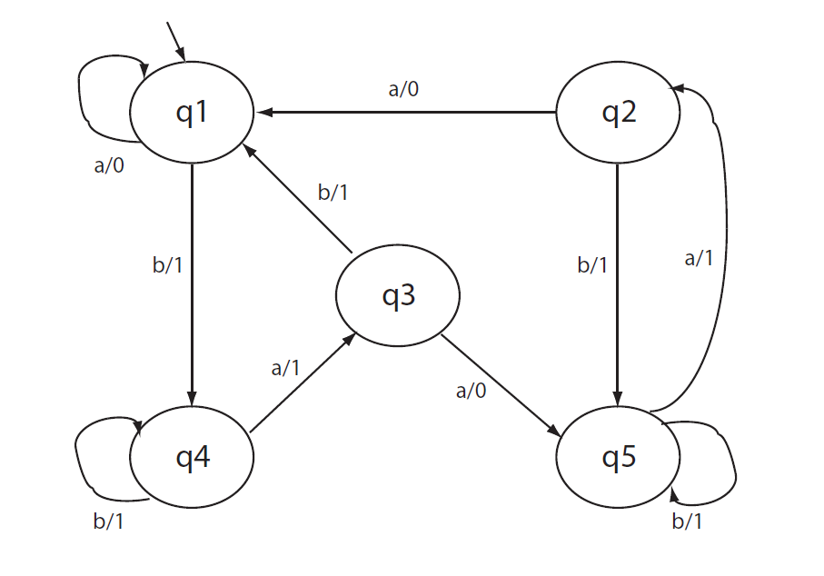
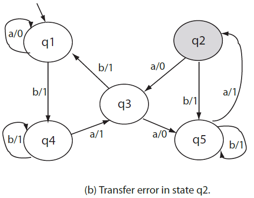
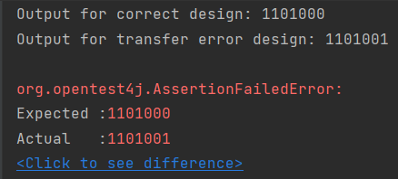
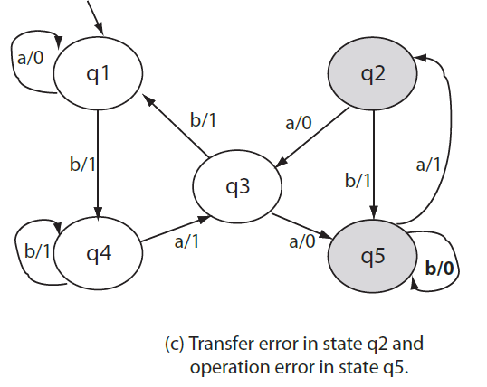
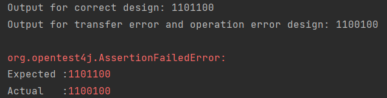
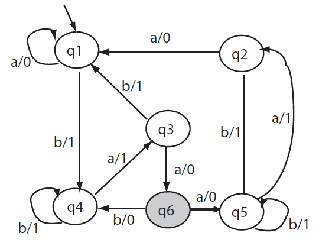
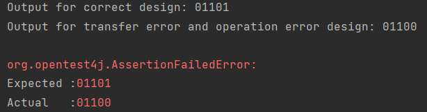
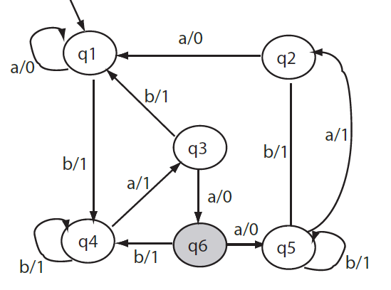
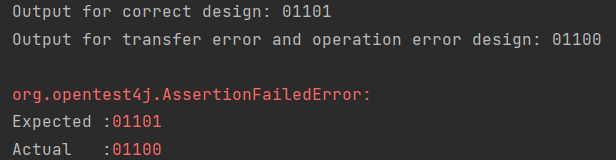

## FSM Based Testing W-method

This Repository is dedicated testing software systems at a general level and caputres the implementation of W-method from the generation of the state partitions and then obtaining the characterization set to the construction of the transition cover set.

The code is built by assuming that the number of states in the FSM derived from the system requirements is equal to the number of states in the instance of IUT (implementation under state), considered as an example and derived from the conceptual design.

At the same time, in order to test the W-method, after the actual generation of the tests, I considered 4 cases of IUT to highlight the usefulness of the method and the differences between the FSM as a concept and a design derived from this concept and proposed for a possible implementation.

The study material for building this algorithm is represented by [Aditya P. Mathur. Foundations of Software Testing, Pearson Education 2008. Chapter 6: Test Generation: FSM Models.](https://www.cs.purdue.edu/homes/apm/foundationsBook/samples/fsm-chapter.pdf)

## The considered FSM

## Calculating Testing set based on the algorithm provided by the above chapter

- Printing W set:
  [[a, a], [a, a, a], [b, a, a, a], [a]]
- Printing P set:
  [[a], [b], [b, a], [b, b], [b, a, a], [b, a, b], [b, a, a, a], [b, a, a, b], [b, a, a, a, a], [b, a, a, a, b], []]
- Printing testing set:
  [[a, a, a], [a, a, a, a], [a, b, a, a, a], [a, a], [b, a, a], [b, a, a, a], [b, b, a, a, a], [b, a], [b, a, a, a], [b, a, a, a, a], [b, a, b, a, a, a], [b, a, a], [b, b, a, a], [b, b, a, a, a], [b, b, b, a, a, a], [b, b, a], [b, a, a, a, a], [b, a, a, a, a, a], [b, a, a, b, a, a, a], [b, a, a, a], [b, a, b, a, a], [b, a, b, a, a, a], [b, a, b, b, a, a, a], [b, a, b, a], [b, a, a, a, a, a], [b, a, a, a, a, a, a], [b, a, a, a, b, a, a, a], [b, a, a, a, a], [b, a, a, b, a, a], [b, a, a, b, a, a, a], [b, a, a, b, b, a, a, a], [b, a, a, b, a], [b, a, a, a, a, a, a], [b, a, a, a, a, a, a, a], [b, a, a, a, a, b, a, a, a], [b, a, a, a, a, a], [b, a, a, a, b, a, a], [b, a, a, a, b, a, a, a], [b, a, a, a, b, b, a, a, a], [b, a, a, a, b, a], [a, a], [a, a, a], [b, a, a, a], [a]]

## Transfer Error Testing

This example will show the difference between applying specific tests on conceptual FSM VS an IUT with a transfer error state.

This is a difference applying test t = baaaaaa

## Transfer Error and Operations

This example will show the difference between applying specific tests on conceptual FSM VS an IUT with a transfer error and operation error state.

This is a difference applying test t = baabaaa

## IUT extra state 1

This example will show the difference between applying specific tests on conceptual FSM VS an IUT with an extra state.

This is a difference applying test t = abaaa

## IUT extra state 2

This example is pretty same with the previous one, the difference is that for input 'b' from state q6 to state q4 is 1 instead of 0.

This is a difference applying test t = abaaa

Regarding the last 2 cases, if we would test for t = baaba, in the first case we will have a difference between fsm and iut but in the second case the test won't reveal the the extra state.